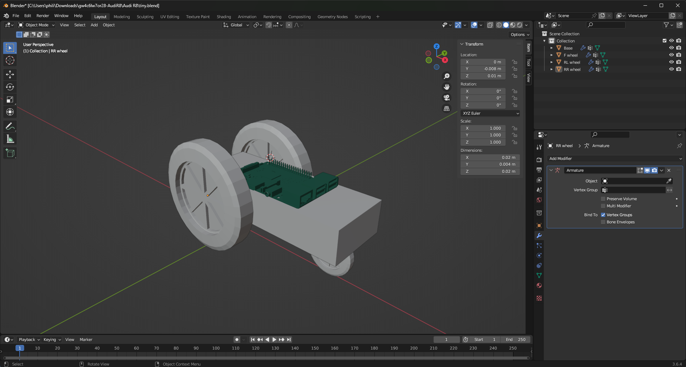
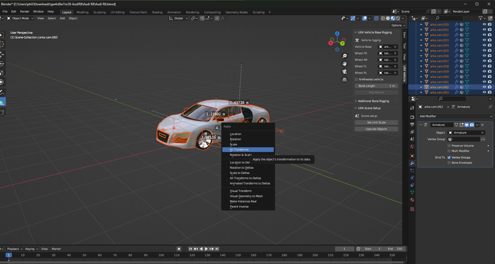
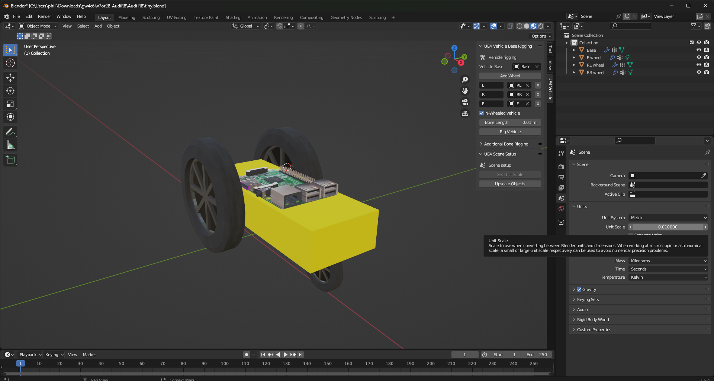
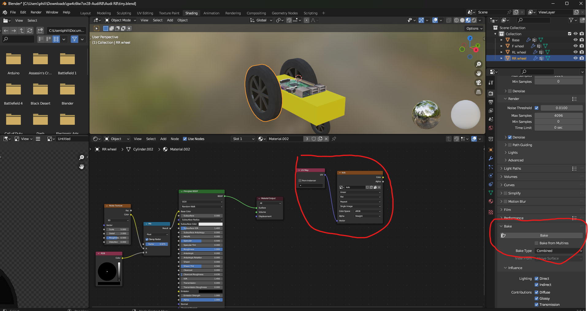
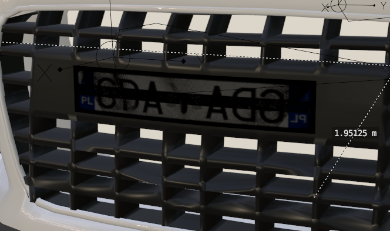
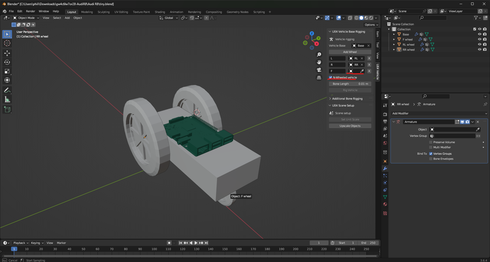
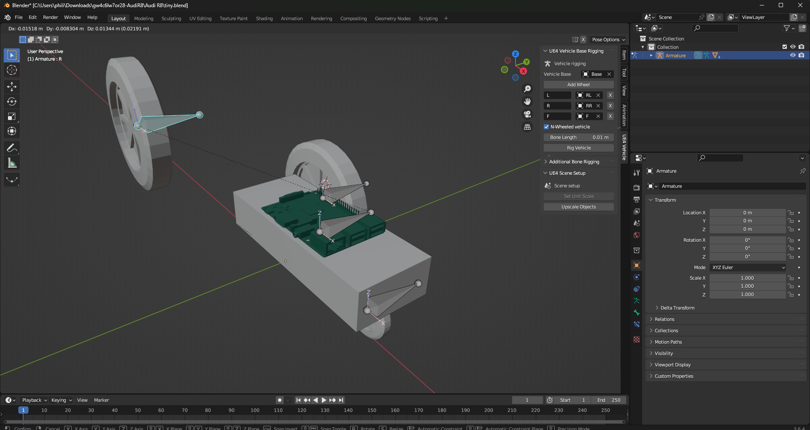
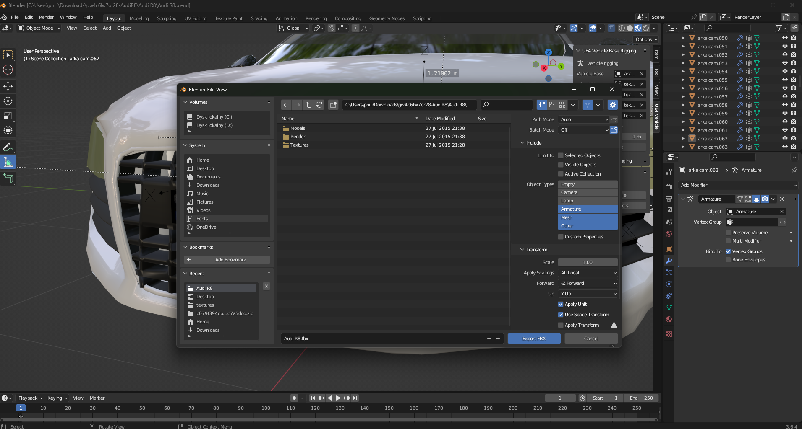
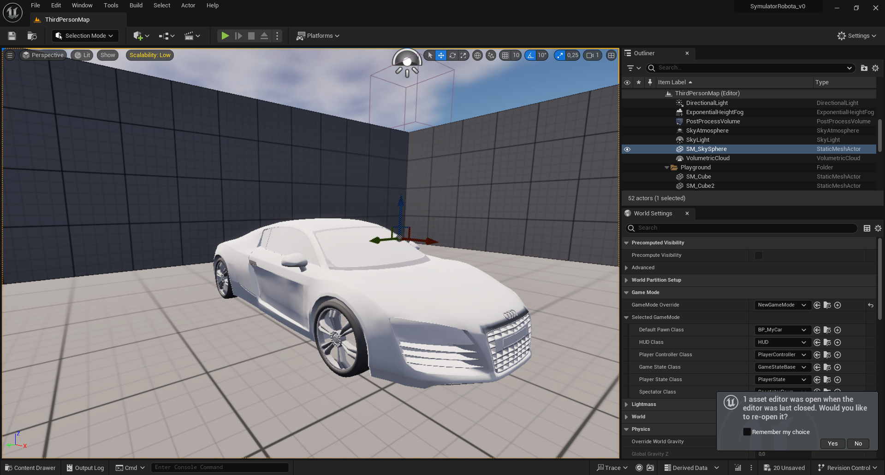

# Model

## Struktura
Model pojazdu musi posiadać jako oddzielny obiekt bazę, do której zamocowane będą koła oraz każde koło lub ruchomy element musi być oddzielnym obiektem. Jest to istotne tylko do procesu tworzenia szkieletu i eksportowania. 

Aby model był poprawnie zorientowany w unrealu należy pamiętać by przód pojazdu "patrzył" w stronę dodatnią osi `X`.

Po zakończeniu eksperymentowania z meshem bardzo ważne jest by zaaplikować wszelkie modyfikatory i transformacje. Modyfikatory aplikujemy w trybie obiektu w zakładce modyfikatorów po prawej stronie interfejsu Blendera. Aby zaaplikować transformacje w trybie obiektu zaznaczamy wszystko na scenie klawieszem `a`, nastepnie wciskamy `ctrl+a` i w świeżo pojawionym okienku `Apply` wybieramy opcję `all transforms`. 

*Baza pojazdu i każde z kół jako oddzielny i jasno nazwany obiekt*

*Okno aplikowania transformacji*

## Skala
Istotnym faktem przy tworzeniu modeli w realistycznej skali jest to, że jednostką podstawową odległości w Blenderze jest metr, ale w Unreal Engine jest to centymetr. Przy eksporcie modele posiadają jedynie "wartość" poszczególnych wielkości bez zapisania jednostki więc jednostkę tę należy przed eksportem przeskalować, inaczej model będzie stukrotnie mniejszy niż zakładaliśmy. Można tego dokonać w zakładce po prawej "Scene" zmieniając "Unit scale" z `1.0`na `0.01`

*Zamiana jednostki odległości z metra na centymetr, czyli `0.01m`*

## Materiały i tekstury
Materiały z blendera nie są kompatybilne z tymi w unreal engine, więc ich eksport nie jest możliwy. W miarę możliwości lepiej unikać tworzenia w blenderze shader node'ów i materiałów polegających na czymś więcej niż posiadaniu tekstury, bo tylko tekstury zostaną zaimportowane do silnika. W szczególnych przypadkach możemy próbować przełączyć silnik renderowania na Cycles i z widoku Shading dodać do drzewa shaderu parę wierzchołka uv mapy i tekstury. Dla wierzchołka tekstury tworzymy nową teksturę i po prawej stronie okna blendera w zakładce Render w kategorii Bake, o ile wybranym silnikiem jest Cycles znajdziemy opcję Bake'owania materiałów w tekstury. Warto mieć na uwadze, że w tej sytuacji jakiekolwiek właściwości materiału zależne od pozycji kamery jak refleksy zostaną na stałe "wydrukowane" na teksturze co w praktyce nie da często pożądanych efektów i dopasowaniem oddziaływania materiału na shader lepiej zająć się w samym unrealu. Gdy dany materiał składa się wyłącznie z nałożenia tekstury proces eksportu powinien bez problemu ją przenieść.

*Para połączonych node'ów od uv mapy i tekstury, dzięki którym blender będzie wiedział gdzie wybake'ować teksturę*

*Przykład nieudanego bake'owania materiału, dziwne cienie i refleks został wydrukowany na stałe na teksturze*

## Szkielet
Proces tworzenia szkieletu modelu może w pełni zautomatyzować darmowy plugin do Blendera UE4_Vehicle_Rigging_Addon wrzucony do repozytorium. Aby utworzyć szkielet wybieramy w okienku rozszerzenia z użyciem pipety, lub wpisując nazwy obiektów ręcznie bazę pojazdu i wszystkie koła. W przypadku ilości kół innej niż 4 wystarczy zaznaczyć opcję "n-wheeled vehicle" i dodać każde z kół do listy ręcznie. Po kliknięciu "Rig vehicle" powinniśmy uzyskać armaturę z kośćmi przypisanymi pojedyńczo do każdego z kół i jedną kością do pozowania pojazdu jako całości.

*Okno rozszerzenia do tworzenia szkieletu pojazdu*

*Poprawnie zbudowany szkielet powinien umożliwiać poruszanie z użyciem kości kół oraz pojazdu jako całość bez jego deformacji*

## Eksport
Gdy mamy już działającą armaturę, jednostki długości są przystosowane do unreala i wszelkie potrzebne materiały są przygotowane w postaci tekstur, model wystarczy wyeksportować do formatu `.FBX`, który jest jedynym formatem rozumianym przez Unreal Engine. Okno eksportowania nie wygląda bardzo nieznajomo poza prawą stroną z opcjami eksportu, które trzeba trochę zmienić:

- W Include > Object Types zaznaczamy jedynie:
- [x] Armature
- [x] Mesh
- [x] Other
(Przytrzymanie Shifta pozwala na zaznaczenie wielu opcji)
- W Transform upewniamy się, że oś `Forward` jest wybrana jako `X Forward` a oś `Up` to `Y Up`.

- W sekcji `Geometry` dla parametru `Smoothing` wybieramy `Face`
- W sekcji `Armature` odznaczamy opcję `Add Leaf Bones`
- Odznaczamy sekcję `Bake Animation`

Po wybraniu nazwy pliku i lokalizacji klikamy `Export FBX`.

## Import
Aby załadować model do Unreala warto utworzyć na pliki modelu oddzielny folder, gdyż w zależności od ilości materiałów może być ich dużo i narobią bałaganu w workspace.  Zaglądając do `Content Drawer` wchodzimy do folderu gdzie mają pojawić się pliki modelu i wybieramy opcję `Import`, wybieramy plik `.FBX` i przechodzimy do ustawień importu. 
- Jeżeli szkielet modelu został poprawnie utworzony opcja `Skeletal Mesh` w sekcji `Mesh` powinna być domyślnie zaznaczona. 
- W sekcji `Material` opcja `Material Import Method` powinna być wybrana jako `Create New Materials`. 
- Dalej klikamy `Import All` i czekamy na załadowanie modelu do silnika.

Zaimportowany model można otworzyć klikając na jego ikonkę podwójnie lub przeciągnąć go na scenę niczym w Unity co utworzy z niego statyczny element otoczenia. Definicja innych właściwości to już temat na osobną notatkę.

*Model audi miał wiele materiałów nie bazujących na teksturach, które nie mogły być zaimportowane. Bez tego pozostaje jedynie próba odtworzenia ich w Unrealu.*