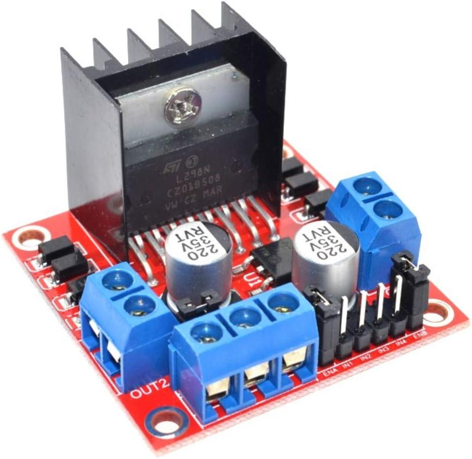
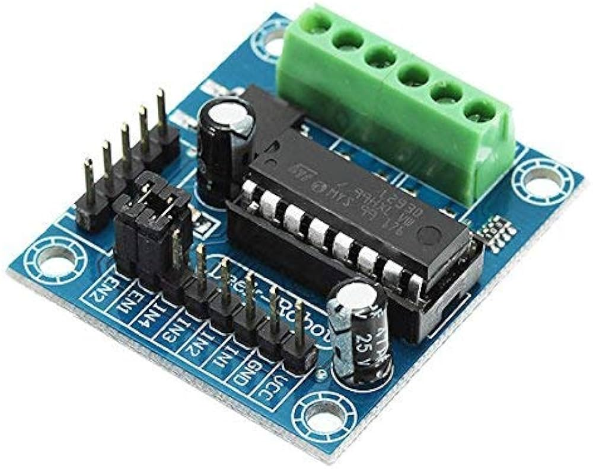
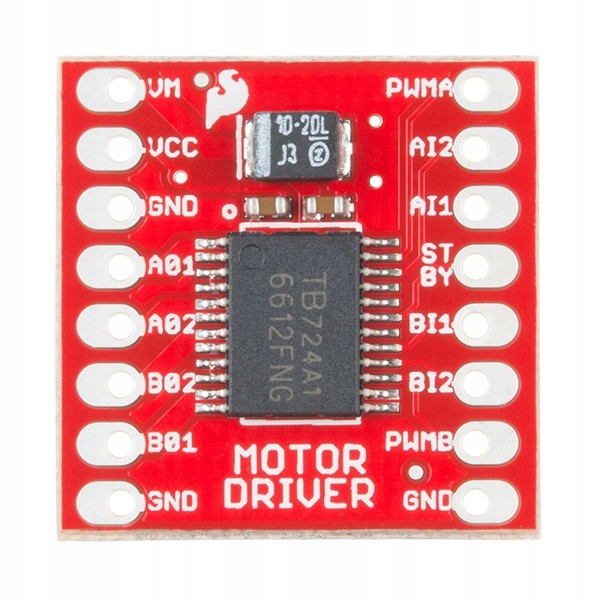

# Moduły Sterownika silników

## Co to i do czego służy
Mikrokontrolery posiadają wyjścia prądu stałego, z których
można zasilać drobne układy elektroniczne, takie jak diody LED,
jednak silniki DC wymagają dużo większej mocy niż mikrokontroler
jest w stanie dostarczyć. Dlatego też stosuje się układy sterujące
silnikami, które działają jak wzmacniacz dla sygnału PWM podawanego
przez mikrokontroler. Dodatkowo taki sterownik powinien posiadać
możliwość zmiany kierunku obrotów silnika, najlepiej poprzez 
wykorzystanie mostka H. W układzie wykorzystującym sterownik
powinny znaleźć się kondensatory filtrujące szumy w sygnale
sterującym oraz zabezpieczenmie przed prądem zwrotnym,
który może powstać w wyniku indukcji w silniku.

## Kryteria wyboru układu sterownika

Istotnymi kryteriami wyboru sterownika silników są:
- maksymalny prąd na kanał
- zakres napięcia operacyjnego
- liczba kanałów
- zabezpieczenia
- wydajność
- cena

## Rozważane dostępne na rynku moduły sterownika silników
### L298N - STMicroelectronics

- maksymalny prąd na kanał: 2A
- zakres napięcia operacyjnego: 3.2V - 40V
- liczba kanałów: 2
- wydajność: 30-70%
- niska cena, 10-20zl, niska dostępność
L298N jest najtańszym sterownikiem silników, jednak
jest on bardzo mało wydajny, co oznacza, że będzie wymagał
dodatkowego chłodzenia, a także zwiększy znacznie zużycie
energii w układzie. 

### L293D - STMicroelectronics

- maksymalny prąd na kanał: 0.6A
- zakres napięcia operacyjnego: 4.5V - 36V
- liczba kanałów: 2
- wydajność: 50-90%
- niska cena, 10-20zl, wysoka dostępność
L293D jest bardzo podobny do L298N, jednak jest on bardziej
wydajny kosztem mniejszego prądu na kanał. W porównaniu do 
L298N jest on również bardziej dostępny na rynku, jednak
wciąż zależnie od napięcia zasilania i aktualnej temperatury
układu jego wydajność może drastycznie spadać i powodować
przegrzewanie.

### TB6612FNG - Toshiba

- maksymalny prąd wyjściowy na kanał: 1.2A
- zakres napięcia operacyjnego: 4.5-15V
- liczba kanałów: 2
- wydajność: 90-95%
- rodzaje zabezpieczeń: przed przegrzaniem, zbyt niskim napięciem
- wyższa cena, 20-80zl, wysoka dostępność
TB6612FNG jest najwydajniejszym sterownikiem silników, oraz
posiada zabezpieczenia przed przegrzaniem i zbyt niskim napięciem.
Jest on również dostępny w większej ilości sklepów niż L298N i L293D
choć jest droższy od nich.

## Wybór układu sterownika
W projekcie wykorzystano układ TB6612FNG, ponieważ jest on
dużo bardziej wydajny od L298N, więc nie będzie wymagał
dodatkowego chłodzenia i nie zwiększy w sposób znaczny
zużycia energii. Układ TB6612FNG z powodu wyższej ceny 
jest dostępny w większej ilości sklepów, w przeciwieństwie 
do L298N, którego brakuje w magazynach wielu sklepów.
Wybrany model układu wykorzystującego TB6612FNG posiada
również kondensatory filtrujące szum sygnału PWM

## Wybór 
Wykorzystywane silniki DC mają napięcie znamionowe 5V i prąd 
0.2A, więc wszystkie sterowniki spełniają wymagania dotyczące
napięcia i prądu. Jednak ze względu na stabilną oraz
najwyższą wydajność, obecne na nim zabezpieczenia oraz wysoką
dostępność na rynku w chwili podejmowania decyzji wybrano
układ zawierający TB6612FNG od producenta
SparkFun Electronics, który choć jest droższy od pozostałych to dzięki
wysokiej wydajności pozwoli na ograniczenie zużycia energii 
w układzie. Na wybranym układzie znajdują się również
kondensatory filtrujące szum sygnału PWM, oraz zabezpieczenie
przed prądem zwrotnym z silników, co zabezpieczy układ zasilający
przed uszkodzeniem.

