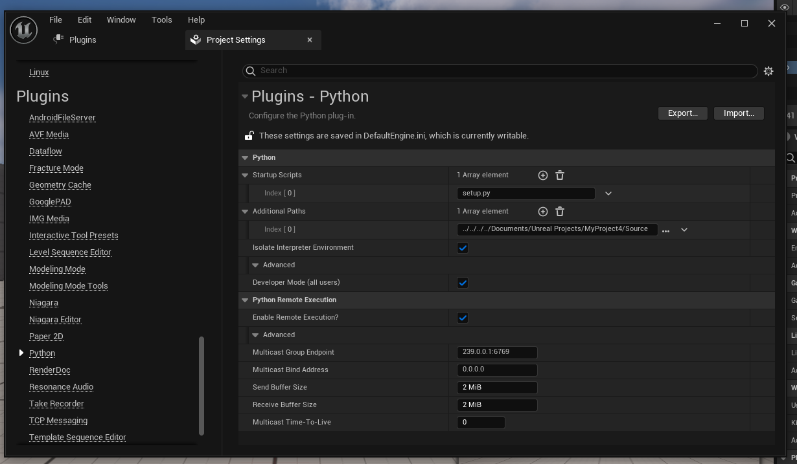

# Yeepee
Udało się znaleźć sposób na wygodne i bezpieczne wywoływanie metod pythonowych z unreala. Czy szybko? Jeszcze się okaże, ale jest to z użyciem oficjalnego pluginu, więc raczej lepiej nie będzie. 

# Jak to działa
Unreal pozwala na uruchamianie skryptów pythonowych:
- przy otwarciu projektu
- ręcznie podając nazwę w konsolce

Myślałem, że do niczego się to nie przyda, bo mają to być takie skrypty konfiguracyjne raczej, ale w takim skrypcie, jak się okazuje, można utworzyć i wyeksportować klasę, której metody będą dostępne z poziomu blueprinta normalnie na liście bloczków. To pozwala na odpalanie w każdej klasie blueprintowej. Wydaje mi się, że uruchamianie ich z c++ nie będzie takie łatwe, co może napsuć trochę plany, ale właściwie może się okazać, że pisanie w c++ w ogóle nie będzie potrzebne (Blueprinty są całkiem szybkie i umożliwiają serio sporo).

# Jak to zrobić
## Plugin Python Editor Script Plugin
W oknie projektu w zakładce `Edit > Plugins` mamy ładne gui do pluginów, wyszukujemy "Python" i upewniamy się, że zainstalowany i włączony jest plugin `Python Editor Script Plugin`.

## Dodanie skryptu do silnika
W oknie projektu klikamy `Edit > Project Settings`, dalej na liście po lewej w zakładce `Plugins` (jest na samym dole) klikamy wpis `Python`. Należy tutaj podać ścieżkę gdzie chcemy trzymać nasze skrypty oraz nazwy poszczególnych skryptów w sekcji `Python`. Dalej w tej samej sekcji zaznaczamy `Developer Mode (all users)`.


W drugiej sekcji konfiguracji tego pluginu o nazwie `Python Remote Execution` możemy skonfigurować plugin do vscode dający podpowiedzi, dokumentację i możliwość odpalania skryptu w unrealu z poziomu vscode. 

## Plugin
Nie jest wymagany, ale pisanie kodu bez podpowiedzi jest moim zdaniem co najmniej mało przyjemne.
Plugin nazywa się `Unreal Engine Python`. Po pobraniu należy wejść w jego konfigurację i ustawić pola na takie same jakie są w sekcji `Python Remote Execution` w configu plugina w unrealu.


Po wszystkim trzeba uruchomić unreala i vscode ponownie.
Jeżeli coś nie działa porównać sobie konfigurację z tym artykulikiem:
https://discourse.techart.online/t/unreal-engine-python-visual-studio-code-extension/15733

Plugin daje do dyspozycji "Komendy", jakiś dziwaczny twór vscodowy, żeby mieć podpowiedzi w kodzie trzeba taką komendę wywołać, podobnie jak w przypadku innych możliwości plugina. Uruchamiamy je wciskając w domyślnej konfiguracji `ctrl+shift+p` i wybierając z listy. Aby włączyć podpowiedzi uruchamiamy komendę `Unreal Python: Setup Code Completion`. Plugin będzie musiał się połączyć z unrealem i już powinno działać.

## Ale jak te skrypty robić
Tworzymy skrypt pythonowy w lokalizacji podanej wcześniej w configu unreala, o podanej również w configu nazwie. Pierwsze co robimy to `import unreal`. Jeżeli plugin Unreal Python działa poprawnie to vscode nie powinien krzyczeć, że takiego modułu nie ma. Aby udostępnić metody do blueprinta używamy dekoratorów z modułu unreal. Przykładowy kod:
```import unreal
@unreal.uclass()
class MyPyFunctionLibrary(unreal.BlueprintFunctionLibrary):        
    @unreal.ufunction(static=True, params=[str], meta=dict(Category="Python"))
    def copycat(string_parameter):
        unreal.log("Got a parameter: " + string_parameter)    
```
Do dekoratorów @unreal.ufunction można przekazywać argumenty by powiedzieć unrealowi szczegóły na temat metody jak np lista argumentów czy wartość zwracana. Moduł unreal daje (według artykułu na stronce unreala) możliwości niemal równe do kodu w c++. Niestety zasobów sieciowych jak tego używać jest dużo mniej niż dla c++, więc chyba lepiej jednak nie korzystać z tego więcej niż trzeba. 

## Blueprinty
Tak utworzony skrypt powinien uruchomić się automatycznie przy starcie projektu, jednak lepiej wywołać go sobie na żądanie. Na dole okna projektu, obok Content Drawer i Ouput Log mamy pole `Cmd` a obok niego pole tekstowe. Pole Cmd po kliknięciu się rozwija. Wybieramy w miejsce Cmd opcję `Python`. Teraz wpisując w pole tesktowe nazwę skryptu i klikając enter uruchomimy go odświeżając listę eksportowanych przez niego metod.

Po wykonaniu zdefiniowane przez nas metody powinny być dostępne z poziomu Blueprintów. 
